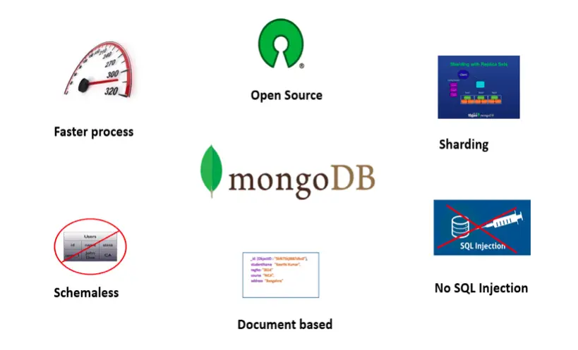
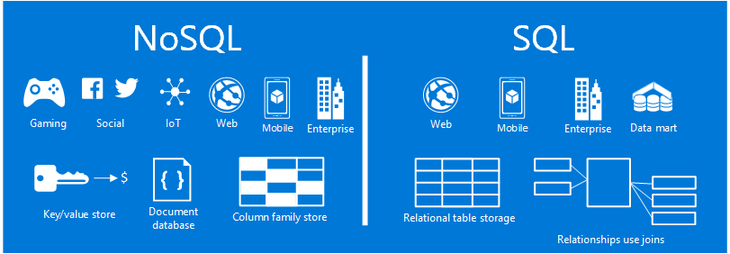
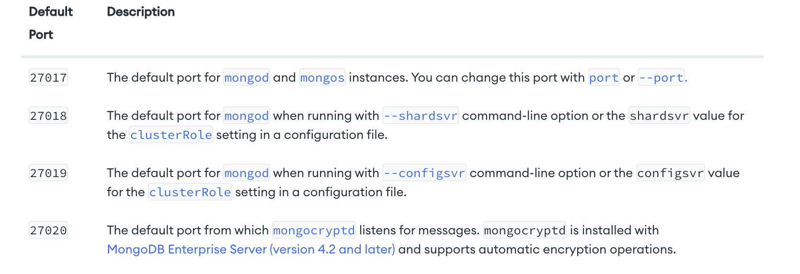

# MONGODB

## What is MongoDB?

- It is a document database, it stores data in flexibla JSON-like documents
- It is open sourced, meaning its available for free and everyone can use it
- Using the sharding method we can distribute data accross multiple machines, this is particularly helpfull when there are large data sets
- With a schemaless database, 90% of the time adjustments to the database become transparent and automatic.

## What are NoSQL databases? 
- NoSQL injection is a security weakness in a web application that uses a NoSQL database. NoSQL (Not Only SQL) refers to database systems that use more flexible data formats and do not support Structured Query Language (SQL). They typically store and manage data as key-value pairs, documents, or data graphs.

## How do they differ from SQL?

- NOSQL has more relaxed restrictions than SQL, making it easier for hackers to attack NOSQL 
- SQL injection executes in the database engine
- NoSQL attack may execute at the database or application layer depending on the data model and NoSQL API

## Why is MongoDB popular? 

- its user base, there is a wide spectrum of customers and users
- the ease of iteration, MongoDB's document-oriented data model makes it exceptionally easy to add or change fields, among other things. 
- It is popular because it's easy to learn and get started

## What is it’s history?

- MongoDB was founded in 2007 by Dwight Merriman, Eliot Horowitz and Kevin Ryan – the team behind DoubleClick.

- At the Internet advertising company DoubleClick (now owned by Google), the team developed and used many custom data stores to work around the shortcomings of existing databases. The business served 400,000 ads per second, but often struggled with both scalability and agility. Frustrated, the team was inspired to create a database that tackled the challenges it faced at DoubleClick.

## Make a diagram to show MongoDB architecture for storing data.

## What is seeding in MongoDB? 

- Database seeding is the initial seeding of a database with data. Seeding a database is a process in which an initial set of data is provided to a database when it is being installed.

## Why do Mongo databases need to be seeded?

## What port does MongoDB use?

## How do you connect to a Mongo database?

1. in the bash terminal get in to virtulisation folder the `vagrant ssh db` to access db on vagrant
2. once in "vagrant@ubuntu-xenial:~$" type `sudo apt update -y` then `sudo apt upgrade -y` 
3. then we need to add the key for mongodb that is available online and we enter like this `sudo apt-key adv --keyserver hkp://keyserver.ubuntu.com:80 --recv D68FA50FEA312927`
4. then to check its worked we enter this `echo "deb https://repo.mongodb.org/apt/ubuntu xenial/mongodb-org/3.2 multiverse" | sudo tee /etc/apt/sources.list.d/mongodb-org-3.2.list`
5. then again we do `sudo apt update -y` then `sudo apt upgrade -y` 
6. and finally to install we `sudo apt-get install -y mongodb-org=3.2.20 mongodb-org-server=3.2.20 mongodb-org-shell=3.2.20 mongodb-org-mongos=3.2.20 mongodb-org-tools=3.2.20`
7. to start mongodb we use `sudo systemctl start mongod`
8. and to check status we then run `sudo systemctl status  mongod`